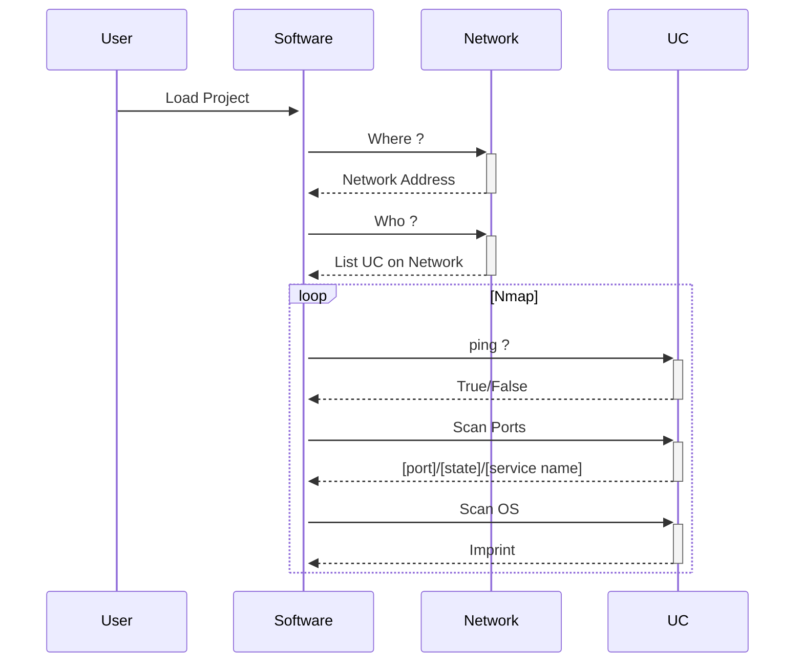

# Projet ***Lan Audacity***

# Recherches
## Questions
- [Comment *Organiser* un *Projet* pour `Lan Audacity`?](#comment-organiser-un-projet-pour-lan-audacity)
- [Quels librairies prendre pour le projet en Python ?](#quels-librairies-prendre-pour-le-projet-en-python-)
- [Comment gérér toutes les données en python ?](#comment-gérér-toutes-les-données-en-python-)
- [Comment lancer un server SQLite en Python ?](#comment-lancer-un-server-sqlite-en-python-)
- [Diagramme de séquence structure](#diagramme-de-séquence-structure)

## Comment *Organiser* un *Projet* pour `Lan Audacity`?
### :clipboard: Organisation des dépendances
#### Dossiers
* :file_folder: `<Project Name>`  
    * :file_folder: `conf`
        * :page_facing_up: `dlc`
        * :page_facing_up: `ssh_storage`
        * :page_facing_up: `data_storage`
        * :page_facing_up: `logs`
    * :file_folder: `databases`
        * :file_folder: `network_infos`
        * :file_folder: `devices_infos`

#### Réseaux
* :globe_with_meridians: `<Network Name 0>`
    * :computer: `<Device Name 0>`
    * :computer: `<Device Name X>`
* :globe_with_meridians: `<Network Name X>`
    * :computer: `<Device Name 0>`
    * :computer: `<Device Name X>`

### :floppy_disk: Organisation des données
#### Logs
|name|dsc_EN|dsc_FR|
|:---|:---|:---|
|`astime`|||
|`name`|||
|`levelname`|||
|`message`|||

#### SSH
|name|dsc_EN|dsc_FR|
|:---|:---|:---|
|`username`|username other than 'root'|nom d'utilisateur différent de 'root'|
|`password`|password|mot de passe|
|`ip_addr`|ip address|adresse ipv4|

#### SNMP
|name|dsc_EN|dsc_FR|oid|
|:---|:---|:---|:--:|
|`ip_addr`||||
|`community`||||
|`nb_port`||||
|condition 1|if `response` is true|||
|`sysDesc`|||1.3.6.1.2.1.1.1|
|`sysObjectID`|||1.3.6.1.2.1.1.2|
|`sysUpTime`|||1.3.6.1.2.1.1.3|
|`sysContact`|||1.3.6.1.2.1.1.4|
|`sysName`|||1.3.6.1.2.1.1.5|
|`sysLocation`|||1.3.6.1.2.1.1.6|
|`sysServices`|||1.3.6.1.2.1.1.7|
|`sysORLastChnage`|||1.3.6.1.2.1.1.8|
|condition 2|if `ip_addr` is `isnetdevice`(true)|||
|`ipRouteTable`|||1.3.6.1.2.1.4.21|
|``||||
|``||||

#### Network
|name|dsc_EN|dsc_FR|
|:---|:---|:---|
|`iconobj`|alias for 'icon Object'||
|`ipv4`|||
|`ipv6`|||
|`mask_ipv4`|||
|`mask_ipv6`|||

#### Network-LAN
|name|dsc_EN|dsc_FR|
|:---|:---|:---|
|`uuid`|||
|`name`|||
|`devicelist`|||

#### Network-Device
|name|dsc_EN|dsc_FR|
|:---|:---|:---|
|`uuid`|||
|`isconnected`|||
|`mac_addr`|||
|`vendor`|||
|`portlist`|||
|`oslist`|||
|condition 1|if `device` has `ssh port`, `telnet port` open||
|`ssh_door`| is true||
|condition 2|if `device` has `http port(s)` open||
|`web_door`| is true||
|condition 3|if `device` has `printer port` open||
|`printer`| is true||
|condition 4|if `device` is `server`||
|`isserver`| is true||
|condition 4|if `device` is `network device`||
|`isnetdevice`| is true||
|``|||
|``|||

## Quels librairies prendre pour le projet en Python ?
|name import|name pip|repository git|
|:---|:---|----|
|`qtawesome`|qtawesome|[spyder-ide/qtawesome](https://github.com/spyder-ide/qtawesome)|
|`nmap`|python-nmap||
|`pysnmp.halpi`|pysnmp|[etingof/pysnmp](https://github.com/etingof/pysnmp)|
|``|||

## Comment gérér toutes les données en python ?
### :floppy_disk: Serveur ou Client-Serveur ou Client-Files
#### Serveur :
1. **Stockage des données** : Utilisez des bases de données comme MySQL, PostgreSQL, SQLite, ou des solutions NoSQL comme MongoDB, selon les besoins de votre application.
   
2. **Traitement des requêtes** : Utilisez un framework web comme Flask ou Django pour gérer les requêtes HTTP et interagir avec les données de manière efficace.
   
3. **Sécurité des données** : Assurez-vous d'utiliser des pratiques de sécurité telles que l'authentification et l'autorisation pour protéger les données sensibles.
   
4. **Gestion des fichiers** : Vous pouvez stocker des fichiers sur le système de fichiers du serveur ou utiliser des services de stockage cloud comme AWS S3.

#### Client-Serveur :

1. **Communication réseau** : Utilisez des protocoles comme HTTP pour la communication entre le client et le serveur.
   
2. **Format des données** : JSON ou XML sont des choix courants pour échanger des données entre le client et le serveur, mais cela dépend du contexte.
   
3. **Gestion des réponses** : Utilisez des bibliothèques comme requests pour envoyer des requêtes depuis le client et traiter les réponses.

#### Client-Files :

1. **Manipulation de fichiers locaux** : Utilisez les fonctions de lecture/écriture de fichiers intégrées à Python pour gérer les fichiers locaux sur le système de fichiers du client.
   
2. **Traitement des données** : Pandas est une excellente bibliothèque pour le traitement des données tabulaires, tandis que NumPy est idéal pour le traitement des données numériques.

3. **Interface utilisateur** : Si vous avez besoin d'une interface graphique, vous pouvez utiliser des bibliothèques comme Tkinter, PyQt, ou Kivy pour créer des applications avec des interfaces utilisateur interactives.

## Comment lancer un server SQLite en Python ?
Pour lancer un serveur SQLite en Python, vous n'avez pas besoin d'installer ou de configurer un serveur séparé comme vous le feriez avec MySQL ou PostgreSQL. SQLite est un moteur de base de données intégré à Python, ce qui signifie que vous pouvez l'utiliser directement sans aucun serveur externe. Voici comment vous pouvez lancer un serveur SQLite en Python :

```python
import sqlite3

# Connexion à la base de données SQLite (créez-la si elle n'existe pas)
conn = sqlite3.connect('ma_base_de_donnees.db')

# Création d'un curseur pour exécuter des requêtes SQL
cur = conn.cursor()

# Exemple de création d'une table
cur.execute('''CREATE TABLE IF NOT EXISTS utilisateurs (
               id INTEGER PRIMARY KEY,
               nom TEXT,
               age INTEGER)''')

# Exemple d'insertion de données dans la table
cur.execute("INSERT INTO utilisateurs (nom, age) VALUES (?, ?)", ('Alice', 30))
cur.execute("INSERT INTO utilisateurs (nom, age) VALUES (?, ?)", ('Bob', 25))

# Valider les modifications et fermer la connexion
conn.commit()
conn.close()
```

Ce code crée une base de données SQLite appelée `ma_base_de_donnees.db`, crée une table `utilisateurs` avec deux colonnes (`nom` et `age`), puis insère deux utilisateurs dans cette table. Vous pouvez exécuter ce script Python, et vous verrez que la base de données sera créée dans le même répertoire que votre script.

SQLite est souvent utilisé pour les applications qui ont des besoins de stockage de données simples et qui n'ont pas besoin d'un serveur de base de données plus complexe. Il est léger, rapide et ne nécessite pas de configuration ou d'administration supplémentaire.

## Diagramme de séquence structure
### :clipboard: Séquence programme

