# MCD Lan Audacity

## MCD GUI
### `qt_actions`
#### v1
```python
from typing import List, Optional, Union, Callable
from dataclasses import dataclass

@dataclass
class Action:
    text: str
    slot: Optional[Callable] = None
    shortcut: Optional[Union[str, List[str]]] = None
    icon: Optional[Union[str, QIcon]] = None
    tip: Optional[str] = None
    checkable: bool = False
    enable: bool = True
```

### `qta_icon`
#### v1
```python
from typing import List, Optional
from dataclasses import dataclass

@dataclass
class Option:
    scale_factor: Optional[float] = None
    color: Optional[str] = None
    active: Optional[str] = None
    offset: Optional[List[float]] = None
    rotated: Optional[int] = None
    vflip: Optional[bool] = None
    hflip: Optional[bool] = None

@dataclass
class Icon:
    name: str
    platform_and_name: List[str]
    options: Optional[List[Option]]

```

#### v2

```mermaid
---
title: qta_icon
---
classDiagram
    direction LR
    app_icon: +str name

    awesome: +str platform
    awesome: +str name

    qta_option: +str color
    qta_option: +float scale_factor
    qta_option: +list offset[float]
    qta_option: +awesomeID active
    qta_option: +int rotated
    qta_option: +bool hflip
    qta_option: +bool hflip
    
    note for qta_option "où est la liste de offset"
    app_icon "1" --o "n" awesome
    app_icon "0" --o "n" qta_option
    qta_option "1" --o "1" awesome
```

### `menu_bar`
### `dlc_package`
## MCD APP
## MCD 