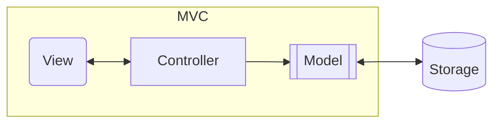
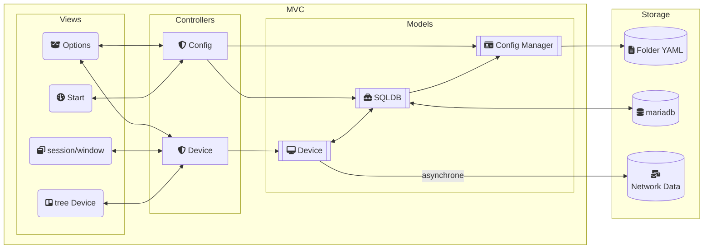

<link
  href="https://cdnjs.cloudflare.com/ajax/libs/font-awesome/6.5.1/css/all.min.css"
  rel="stylesheet"
/>

# Déroulement Opérations
## Descriptions
1. Lancement de l'application :
   - Double click sur le raccourci du setup
2. Ouverture de la fenêtre (avec tkinter)
    - Affichage au démarrage au centre du bureau
    - géométrie de la fenêtre 400x400
3. Lancement Frame de chargement
   - des fichiers de configuration
   - des ressources
4. Ouverture Frame d'accueil
   - New Session
   - Last Session
   - 
5. 
### Datagrammes
#### Général

#### Exact

## Schémas
### Frame Top
Au top de l'application il y aura:
- Menu → icon svg home
- Session Utilisateur → icon svg user_more
- Recherches/ Options → icon svg search
- paramètres globals → icon svg setup
- Notifications → icon svg cloche
### Frame Tree Device
Sur la gauche il y aura un arbre des dépendances :  

| Affichage    | Contenu         | Actions          |
|:-------------|:----------------|:-----------------|
| Titre        | Network Devices | icon refresh all |
| Sous-titre 1 | Adresse du lan  | icon refresh     |
| liste 1      | adresses IP     |                  |
| Sous-titre 2 | Adresse du lan  | icon refresh     |
| liste 2      | adresses IP     |                  |
| Sous-titre N | Adresse du lan  | icon refresh     |
| liste N      | adresses IP     |                  |

Condition pour Contenu :
- Si hostname est différent de 'Inconnu' alors remplacer adresse IP par hostname
### Frame Window Integration
Au centre il y aura un espace à onglets et fenêtres avec 1 onglet pour 1 adresse IP.

En dessous de l'espace à onglets et fenêtres un ruban d'options :
- affichage carte réseau → icon svg carte
- ouverture/ fermeture d'un onglet console → icon svg console
- rafraichir les informations de l'onglet ouvert → icon svg cercle flèche
- paramètres ou informations de l'onglet ouvert → icon svg roue cranté

### Frame Footer
En pied d'application il y aura plusieurs informations dont :
- la version du logiciel
- heure du dernier scan

# Stucture de l'application
